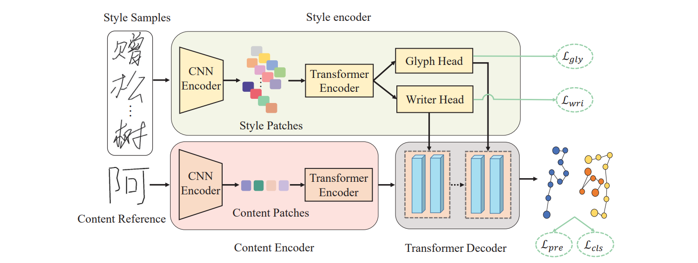
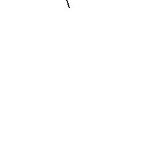
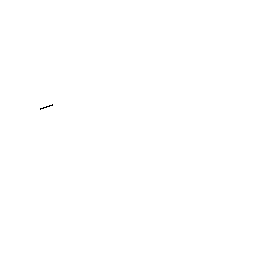
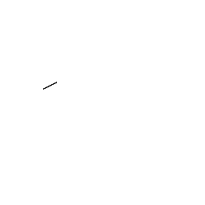
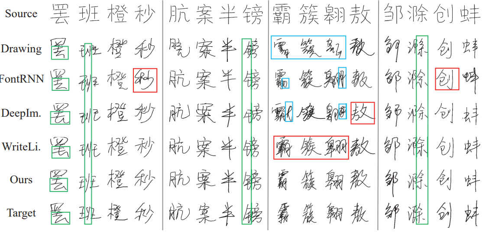
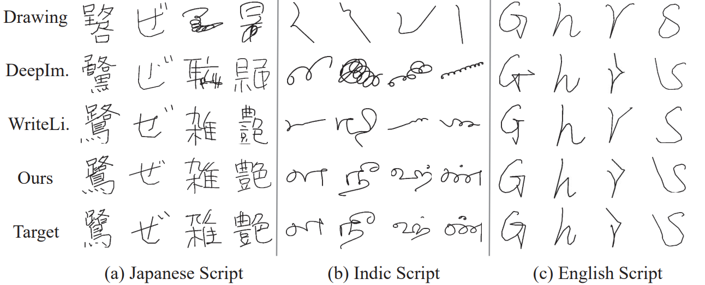
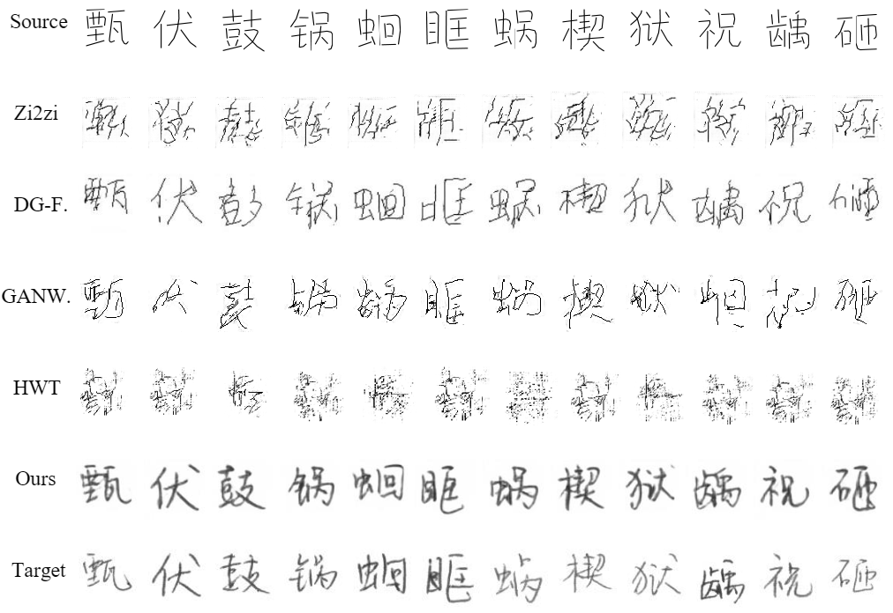
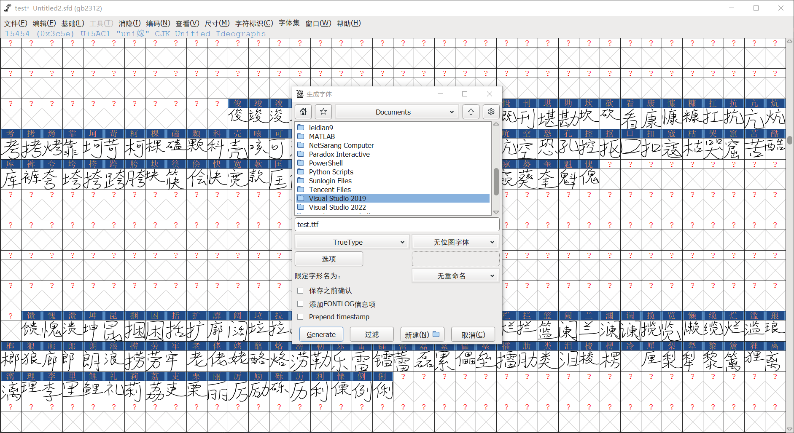
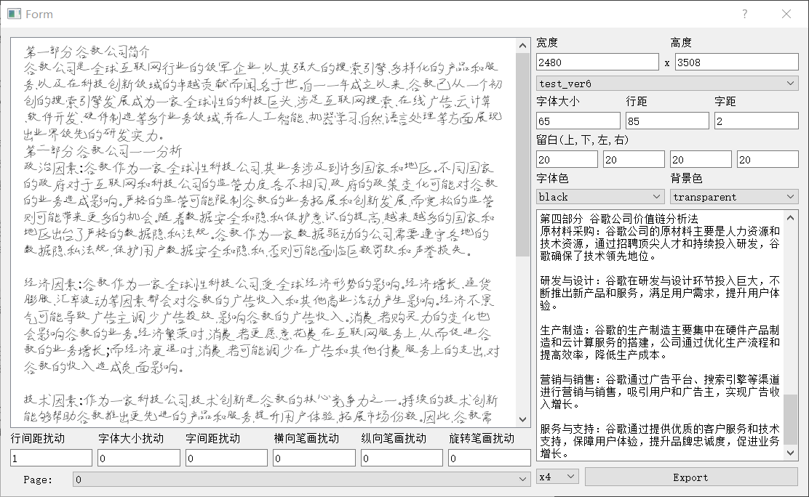
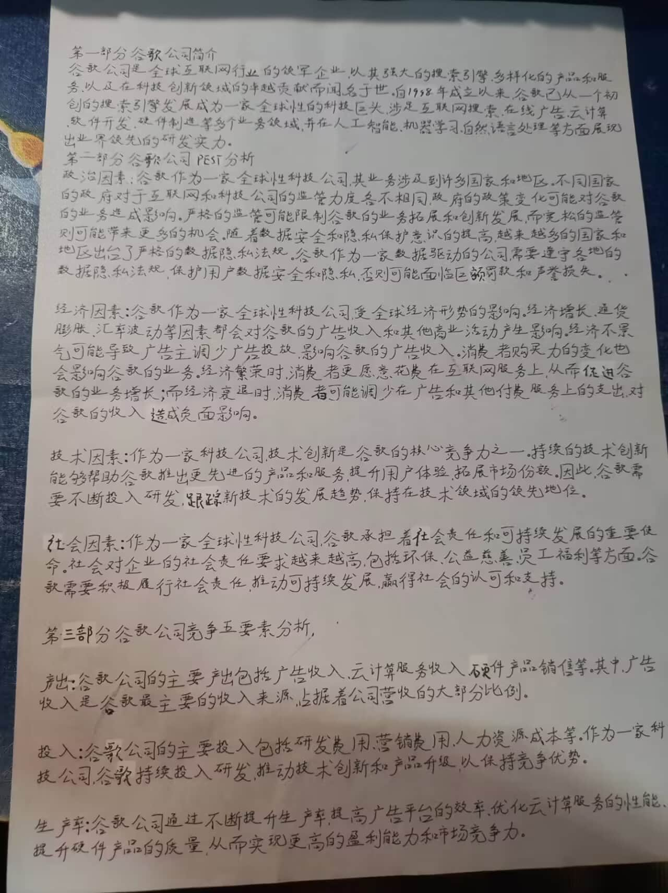

# 🔥 Disentangling Writer and Character Styles for Handwriting Generation

 <p align='center'>
  <b>
    <a href="https://arxiv.org/abs/2303.14736">ArXiv</a>
    |
    <a href="https://github.com/dailenson/SDT/blob/master/static/Poster_SDT.pdf">Poster</a>
    | 
    <a href="https://youtu.be/mKbYLEwa4dI">Video</a>
    | 
    <a href="https://cvpr2023.thecvf.com/virtual/2023/poster/20954">Project</a>
  </b>
</p> 

## 📢 Introduction
- The proposed style-disentangled Transformer (SDT) generates online handwritings with conditional content and style. 
- Existing RNN-based methods mainly focus on capturing a person’s overall writing style, neglecting subtle style inconsistencies between characters written by the same person. In light of this, SDT disentangles the writer-wise and character-wise style representations from individual handwriting samples for enhancing imitation performance. 
- We extend SDT and introduce an offline-to-offline framework for improving the generation quality of offline Chinese handwritings.

<div style="display: flex; flex-direction: column; align-items: center; ">

</div>
<p align="center" style="margin-bottom: 10px;">
Overview of our SDT
</p>

<div style="display: flex; justify-content: center;">

</div>
<p align="center">
Three samples of online characters with writing orders
</p>

## 📅 News
- [2025/06/26] 🎉🎉🎉 [DiffBrush](https://github.com/dailenson/DiffBrush), a novel state-of-the-art approach for full-line text generation, is accepted to ICCV 2025.
- [2024/11/26] 🎉🎉🎉 Release of the implementations of Content Score and Style Score. 
- [2024/07/01] 🎉🎉🎉 A new state-of-the-art method for handwritten text generation, named [One-DM](https://github.com/dailenson/One-DM), is accepted by ECCV 2024. 
- [2024/01/07] Add a tutorial and code for synthesizing handwriting with user-customized styles, more information can be found [here](https://github.com/dailenson/SDT/issues/43).
- [2023/12/15] 🎉🎉🎉 This work is reported by a top [bilibili](https://www.bilibili.com/video/BV19w411t7vD/?buvid=XX73A437799B0DCC93D6D21690FA9CAE696EC&from_spmid=default-value&is_story_h5=false&mid=Xr0IfLrZqLFnTCriRB2HcQ%3D%3D&p=1&plat_id=116&share_from=ugc&share_medium=android&share_plat=android&share_session_id=2f9e186f-d693-4b61-80c6-372942bec32b&share_source=WEIXIN&share_source=weixin&share_tag=s_i&spmid=united.player-video-detail.0.0&timestamp=1720580374&unique_k=OqWsKIV&up_id=19319172) video blogger with 2.7 million followers and received nearly one million views.
- [2023/10/10] The [author](https://scholar.google.com.hk/citations?user=a2SwkisAAAAJ&hl=zh-CN) is invited to give a [talk](https://www.bilibili.com/video/BV1kQ4y1W7a7/?spm_id_from=333.999.0.0&vd_source=cbc77ced94dbf77f5ecef4e0afa94a33) (in Chinese) by CSIG (China Society of Image and Graphics).
- [2023/06/14] This work is reported by [Synced](https://mp.weixin.qq.com/s/EX_Loj4PvIztQH5zrl2FNw) (机器之心).
- [2023/04/12] Initial release of the datasets, pre-trained models, training and testing codes.
- [2023/02/28] 🎉🎉🎉 Our SDT is accepted by CVPR 2023.

## 📺 Handwriting generation results
- **Online Chinese handwriting generation**


- **Applications to various scripts**

- **Extension on offline Chinese handwriting generation**



## 🔨 Requirements
```
conda create -n sdt python=3.8 -y
conda activate sdt
# install all dependencies
conda env create -f environment.yml
```

## 📂 Folder Structure
  ```
  SDT/
  │
  ├── train.py - main script to start training
  ├── test.py - generate characters via trained model
  ├── evaluate.py - evaluation of generated samples
  │
  ├── configs/*.yml - holds configuration for training
  ├── parse_config.py - class to handle config file
  │
  ├── data_loader/ - anything about data loading goes here
  │   └── loader.py
  │
  ├── model_zoo/ - pre-trained content encoder model
  │
  ├── data/ - default directory for storing experimental datasets
  │
  ├── model/ - networks, models and losses
  │   ├── encoder.py
  │   ├── gmm.py
  │   ├── loss.py
  │   ├── model.py
  │   └── transformer.py
  │
  ├── saved/
  │   ├── models/ - trained models are saved here
  │   ├── tborad/ - tensorboard visualization
  │   └── samples/ - visualization samples in the training process
  │
  ├── trainer/ - trainers
  │   └── trainer.py
  │  
  └── utils/ - small utility functions
      ├── util.py
      └── logger.py - set log dir for tensorboard and logging output
  ```

## 💿 Datasets

We provide Chinese, Japanese and English datasets in [Google Drive](https://drive.google.com/drive/folders/17Ju2chVwlNvoX7HCKrhJOqySK-Y-hU8K?usp=share_link) | [Baidu Netdisk](https://pan.baidu.com/s/1RNQSRhBAEFPe2kFXsHZfLA) PW:xu9u. Please download these datasets, uzip them and move the extracted files to /data.

## 🍔 Pre-trained model

| Model|Google Drive|Baidu Netdisk|
|---------------|---------|-----------------------------------------|
|Well-trained SDT|[Google Drive](https://drive.google.com/drive/folders/1LendizOwcNXlyY946ThS8HQ4wJX--YL7?usp=sharing) | [Baidu Netdisk](https://pan.baidu.com/s/1RNQSRhBAEFPe2kFXsHZfLA?pwd=xu9u)
|Content encoder|[Google Drive](https://drive.google.com/drive/folders/1N-MGRnXEZmxAW-98Hz2f-o80oHrNaN_a?usp=share_link) | [Baidu Netdisk](https://pan.baidu.com/s/1RNQSRhBAEFPe2kFXsHZfLA?pwd=xu9u)
|Content Score|[Google Drive](https://drive.google.com/drive/folders/1-2ciY6yfI4l1bVUD661EzEW5PInZb_62?usp=sharing)|[Baidu Netdisk]( https://pan.baidu.com/s/1cs8qWOhwISZz7w1dAYMQ3g?pwd=s8e8)
|Style Score|[Google Drive](https://drive.google.com/drive/folders/1-2ciY6yfI4l1bVUD661EzEW5PInZb_62?usp=sharing) | [Baidu Netdisk]( https://pan.baidu.com/s/1cs8qWOhwISZz7w1dAYMQ3g?pwd=s8e8)

**Note**:
Please download these weights, and move them to /model_zoo.

## 🚀 Training & Test
**Training**
- To train the SDT on the Chinese dataset, run this command:
```
python train.py --cfg configs/CHINESE_CASIA.yml --log Chinese_log
```

- To train the SDT on the Japanese dataset, run this command:
```
python train.py --cfg configs/Japanese_TUATHANDS.yml --log Japanese_log
```

- To train the SDT on the English dataset, run this command:
```
python train.py --cfg configs/English_CASIA.yml --log English_log
```

**Qualitative Test**
- To generate **online Chinese handwritings** with our SDT, run this command:
```
python test.py --pretrained_model checkpoint_path --store_type online --sample_size 500 --dir Generated/Chinese
```
- To generate **offline Chinese handwriting images** with our SDT, run this command:
```
python test.py --pretrained_model checkpoint_path --store_type offline --sample_size 500 --dir Generated_img/Chinese
```

- To generate **online Japanese handwritings** with our SDT, run this command:
```
python test.py --pretrained_model checkpoint_path --store_type online --sample_size 500 --dir Generated/Japanese
```
- To generate **offline Japanese handwriting images** with our SDT, run this command:
```
python test.py --pretrained_model checkpoint_path --store_type offline --sample_size 500 --dir Generated_img/Japanese
```
- To generate **online English handwritings** with our SDT, run this command:
```
python test.py --pretrained_model checkpoint_path --store_type online --sample_size 500 --dir Generated/English
```
- To generate **offline English handwriting images** with our SDT, run this command:
```
python test.py --pretrained_model checkpoint_path --store_type offline --sample_size 500 --dir Generated_img/English
```

**Quantitative Evaluation**
- To evaluate the generated handwritings, you need to set `data_path` to the path of the generated handwritings (e.g., Generated/Chinese), and run this command:
```
python evaluate.py --data_path Generated/Chinese --metric DTW
```
- To calculate the Content Score of generated handwritings, you need to set `data_path` to the path of the generated handwritings (e.g., Generated/Chinese), and run this command:
```
python evaluate.py --data_path Generated/Chinese --metric Content_score --pretrained_model model_zoo/chinese_content_iter30k_acc95.pth
```
- To calculate the Style Score of generated handwritings, you need to set `data_path` to the path of the generated handwriting images (e.g., Generated_img/Chinese), and run this command:
```
python evaluate.py --data_path Generated_img/Chinese --metric Style_score --pretrained_model models_zoo/chinese_style_iter60k_acc999.pth
```
## 🏰 Practical Application
We are delighted to discover that **[P0etry-rain](https://github.com/P0etry-rain)** has proposed a pipeline that involves initially converting the generated results by our SDT to TTF format, followed by the development of software to enable flexible adjustments in spacing between paragraphs, lines, and characters. Below, we present TTF files, software interface and the printed results. More details can be seen in [#78](https://github.com/dailenson/SDT/issues/78#issue-2247810028).
- **TTF File**


- **Software Interface**


- **Printed Results**



## ❤️ Citation
If you find our work inspiring or use our codebase in your research, please cite our work:
```
@inproceedings{dai2023disentangling,
  title={Disentangling Writer and Character Styles for Handwriting Generation},
  author={Dai, Gang and Zhang, Yifan and Wang, Qingfeng and Du, Qing and Yu, Zhuliang and Liu, Zhuoman and Huang, Shuangping},
  booktitle={Proceedings of the IEEE/CVF Conference on Computer Vision and Pattern Recognition,
  pages={5977--5986},
  year={2023}
}
```

## ⭐ StarGraph
[](https://star-history.com/#dailenson/SDT&Timeline)


